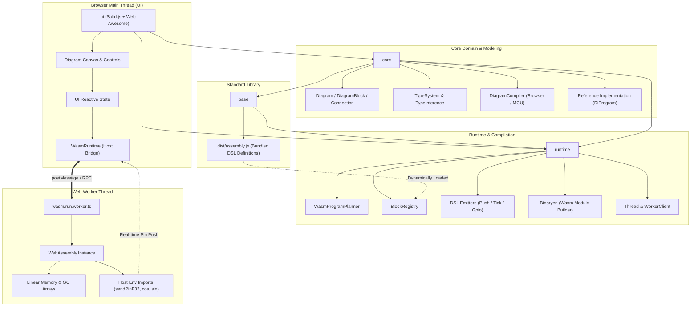
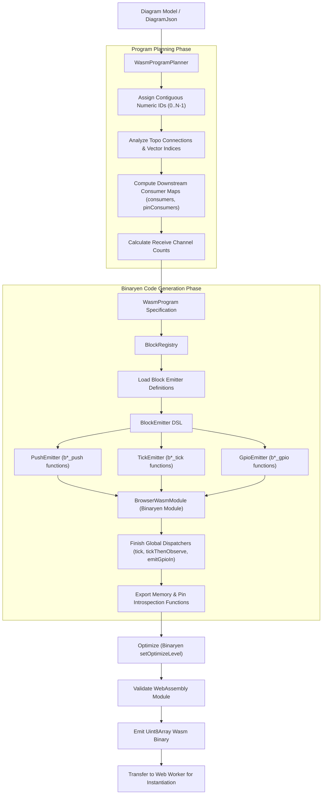
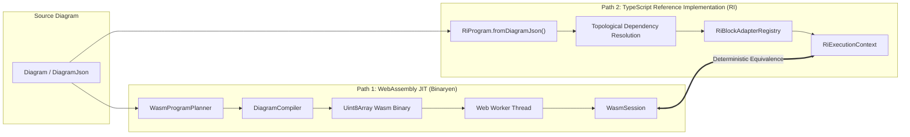
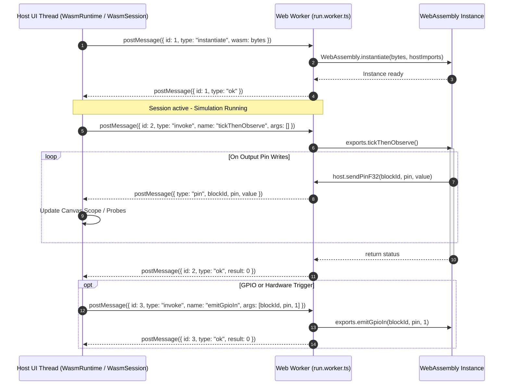
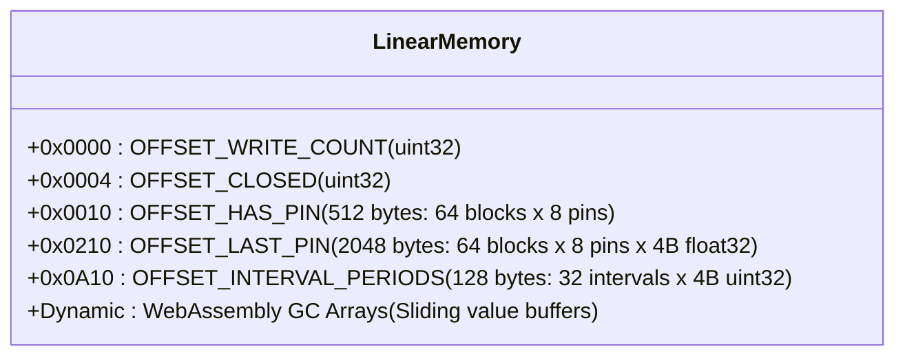
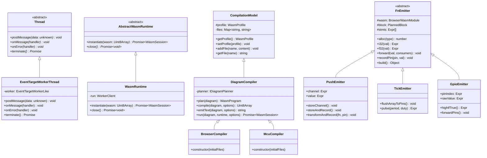
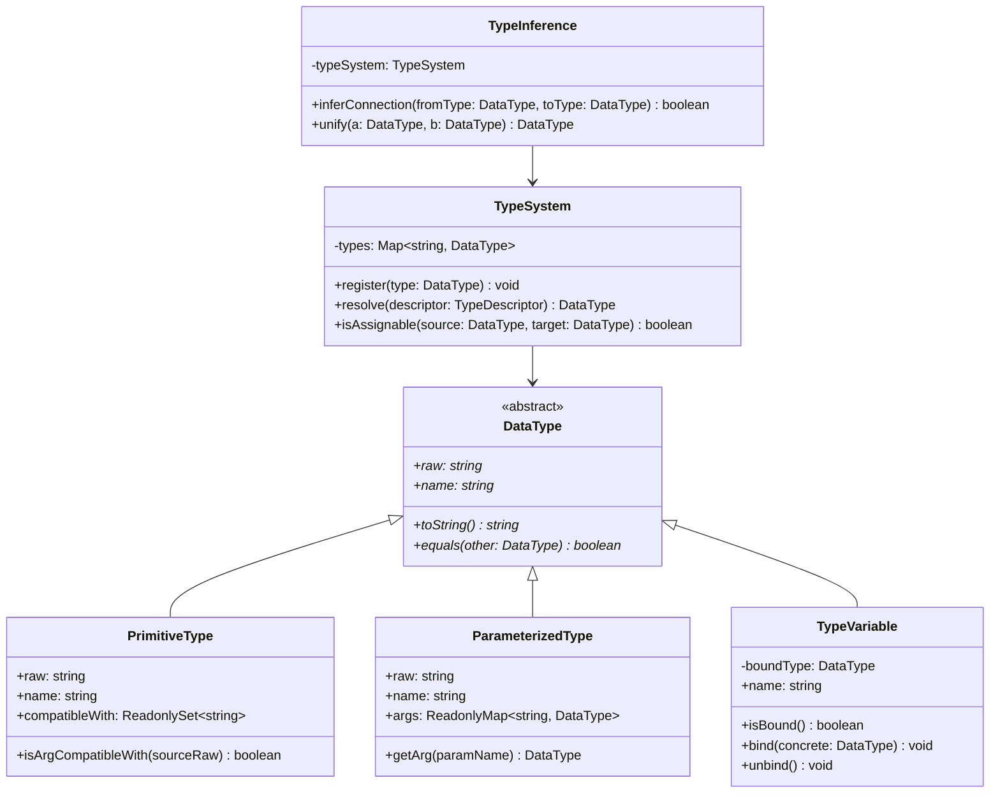

[](https://www.typescriptlang.org/)
[](https://webassembly.org/)
[](https://github.com/WebAssembly/binaryen)
[](https://www.solidjs.com/)
[](https://rsbuild.dev/)
[](LICENSE)

> A modern, client-side Visual Programming IDE and compiler for creating, editing, and executing reactive dataflow diagrams. Diagrams compile ahead-of-time in the browser to high-performance **WebAssembly** via **Binaryen**, running isolated inside Web Worker threads, with an MCU deployment target reserved for embedded devices.

---

## Table of Contents

- [Overview](#overview)
- [Key Features](#key-features)
- [Architecture & Monorepo Layout](#architecture--monorepo-layout)
- [System Architecture](#system-architecture)
- [Compilation Pipeline](#compilation-pipeline)
- [Dual-Runtime Execution Engine](#dual-runtime-execution-engine)
- [Worker Threading & Host Communication](#worker-threading--host-communication)
- [Linear Memory & Buffer Layout](#linear-memory--buffer-layout)
- [Object-Oriented Design & Class Hierarchies](#object-oriented-design--class-hierarchies)
- [Type System & Inference](#type-system--inference)
- [Standard Block Library (`base`)](#standard-block-library-base)
- [JSON Diagram Specification & Schemas](#json-diagram-specification--schemas)
- [Getting Started](#getting-started)
  - [Prerequisites](#prerequisites)
  - [Installation](#installation)
  - [Build](#build)
  - [Running the Development Server](#running-the-development-server)
  - [Running Tests](#running-tests)
- [Testing Strategy](#testing-strategy)
- [License](#license)

---

## Overview

**bld** provides a modular, visual programming environment designed for high-performance reactive computation. Users build diagrams from typed blocks (sources, mathematical transformers, filters, sinks, and hardware I/O pins) connected by vectorized stream channels.

The project features a **client-side only** architecture:
1. **Visual Diagram Modeling**: Interactive canvas for assembling signal processing pipelines and reactive control algorithms.
2. **Direct WebAssembly Compilation**: The diagram is topologically planned and compiled directly to WebAssembly bytecode in the browser using **Binaryen**, leveraging typed arrays and Wasm GC features.
3. **Isolated Threaded Simulation**: Generated WebAssembly binaries execute in dedicated **Web Worker threads**, keeping UI rendering responsive at 60 FPS while streaming real-time pin observations back to the host.
4. **Dual Runtimes**: Alongside the JIT WebAssembly compiler, a reference TypeScript implementation (**RI**) provides deterministically identical execution for validation, testing, and headless execution.

---

## Key Features

- **Pure Client-Side Execution**: Zero backend dependencies; compilation and execution take place entirely within the browser.
- **Binaryen-Powered Wasm Code Generator**: Emits optimized WebAssembly modules with functions for push-driven event delivery (`b<id>_push`), periodic intervals (`b<id>_tick`), and GPIO input events (`b<id>_gpio`).
- **Web Worker Thread Isolation**: All runtime execution runs off the main thread with non-blocking RPC communication and streaming pin updates.
- **Sliding Scope Buffers**: High-rate signal capture implemented via sliding circular/pinned buffers in linear memory and WebAssembly GC arrays.
- **Parametric Type System**: Full support for primitive types (`f32`, `i32`, `bool`), type variables (`?T`), and parameterized stream types (`pss<f32>`) with automatic bidirectional type inference.
- **JSON Schema-Backed Serialization**: Clean JSON diagram format adhering to formal JSON Schemas. Properties matching default values are automatically omitted for clean version control diffs.
- **Extensible Block DSL**: Domain-Specific Language in TypeScript allowing new block primitives to define push, tick, and GPIO handlers with type-safe AST construction.
- **Production-Ready UI Stack**: Built on Solid.js, Web Awesome, dark mode by default, and bundled with Rsbuild.

---

## Architecture & Monorepo Layout

The repository is structured as an npm multi-workspace monorepo:

```
bld/
├── base/        # Standard block library implemented via the runtime DSL (bundled to assembly.js)
├── core/        # Domain model, Diagram, TypeSystem, Schemas, Assets, and Reference Implementation (RI)
├── runtime/     # WebAssembly compiler (Binaryen), Program Planner, DSL emitters, Worker thread bridge
└── ui/          # Solid.js frontend, canvas, Web Awesome components, worker runners, and Rsbuild config
```

### Package Responsibilities

| Package | Purpose | Key Responsibilities |
|---|---|---|
| **`runtime`** | Compilation & Wasm Execution | Binaryen AST generation, `WasmProgramPlanner`, `BlockEmitter` DSL (`PushEmitter`, `TickEmitter`, `GpioEmitter`), memory layout, `Thread` abstraction, `WasmRuntime`, `WasmSession`. |
| **`base`** | Standard Block Library | Standard library definitions (`scope_f32`, `sum_f32`, `product_f32`, `sin_f32`, `cos_f32`, `const_f32`, `cos_gen_f32`, `sin_gen_f32`, `rand_gen_f32`, `pulse_gen_f32`, `gpio_in`). Bundled with esbuild into `dist/assembly.js`. |
| **`core`** | Domain Model & Schemas | `Diagram`, `DiagramBlock`, `Connection`, `PortEndpoint`, `Palette`, `Library`, `TypeSystem`, `TypeInference`, JSON Schema catalog, and `RiProgram` (TypeScript Reference Implementation). |
| **`ui`** | User Interface & Worker Host | Solid.js web app, dark UI theme, canvas interactions, Rsbuild dev server, Cloudflare Pages deployment configuration (`wrangler.json`), browser Worker hosting (`run.worker.ts`). |

---

## System Architecture

The following diagram illustrates the dependency topology and system boundaries across the packages and host environments:



---

## Compilation Pipeline

When a diagram is executed, it passes through an ahead-of-time compilation pipeline that turns diagram nodes and connections into optimized WebAssembly bytecode:



---

## Dual-Runtime Execution Engine

The platform provides two independent execution paths, allowing users and automated tests to verify compilation outputs against reference behavior:



- **WebAssembly Engine**: Generates lean machine code for maximum throughput. Used for browser simulation and MCU targeting.
- **Reference Implementation (RI)**: An in-memory push-stream engine (`push.f32.*`) modeling exact floating-point behaviors, used for integration tests, debugging, and verification.

---

## Worker Threading & Host Communication

To maintain 60 FPS in the user interface, WebAssembly execution is completely offloaded to a Web Worker. Communication is managed over an asynchronous message-passing RPC bridge:



---

## Linear Memory & Buffer Layout

The browser WebAssembly profile allocates a single WebAssembly memory page (64 KB) with an organized deterministic linear layout:



```
+-------------------+-------------------+-------------------+-------------------+-----------------------+
|  WRITE_COUNT (4B) |    CLOSED (4B)    |   HAS_PIN (512B)  |  LAST_PIN (2048B) | INTERVAL_PERIODS (128)|
|     offset 0      |     offset 4      |     offset 16     |    offset 528     |      offset 2576      |
+-------------------+-------------------+-------------------+-------------------+-----------------------+
| Total pin updates | Stop flag (0 or 1)| Pin active bitset | Latest f32 values |  Tick interval table  |
+-------------------+-------------------+-------------------+-------------------+-----------------------+
```

- **Sliding Scope Buffers**: High-frequency sink blocks allocate internal WebAssembly GC arrays (`array.new_data`, `array.set`, `array.get`) with an offset pointer, preventing GC stalls and memory leaks during long-running simulations.
- **Pin Inspection**: Host threads can asynchronously probe pin values directly via exported getters (`lastPin(blockId, pin)`, `hasPin(blockId, pin)`, `pinWriteCount()`).

---

## Object-Oriented Design & Class Hierarchies

Following the codebase's strict Object-Oriented Programming (OOP) standard, core capabilities are modeled through inheritance, strict encapsulation, and clean contracts:



---

## Type System & Inference

The type system defines safety guarantees for vector connections between block ports:



- **Primitive Types**: Standard scalar values: `f32`, `i32`, `i64`, `bool`, `string`.
- **Parameterized Types**: Generic collections and stream wrappers, e.g., `pss<f32>` (push-stream scalar).
- **Type Variables**: Unbound variables (e.g. `?T`) automatically unified during connection validation.

---

## Standard Block Library (`base`)

The standard library includes fundamental building blocks for digital signal processing, simulation, and hardware interfacing:

| Block Reference | Category | Inputs | Outputs | Description |
|---|---|---|---|---|
| `const_f32` | Source | None | `v` (`pss<f32>`) | Emits a constant floating-point value. |
| `sin_gen_f32` | Source | None | `v` (`pss<f32>`) | Periodic harmonic sine wave generator over time. |
| `cos_gen_f32` | Source | None | `v` (`pss<f32>`) | Periodic harmonic cosine wave generator over time. |
| `rand_gen_f32` | Source | None | `v` (`pss<f32>`) | Pseudo-random uniform noise generator. |
| `pulse_gen_f32` | Source | None | `v` (`pss<f32>`) | Square wave pulse generator with configurable period and duty cycle. |
| `gpio_in` | Source | Hardware Pin | `pin` (`pss<f32>`) | Multi-pin digital GPIO input with reactive push notification. |
| `sin_f32` | Transformer | `v` (`pss<f32>`) | `sin` (`pss<f32>`) | Unary sine function applied to incoming push values. |
| `cos_f32` | Transformer | `v` (`pss<f32>`) | `cos` (`pss<f32>`) | Unary cosine function applied to incoming push values. |
| `sum_f32` | Transformer | `v` (vector `pss<f32>`) | `s` (`pss<f32>`) | Multi-channel vector summation. |
| `product_f32` | Transformer | `v` (vector `pss<f32>`) | `p` (`pss<f32>`) | Multi-channel vector multiplication. |
| `scope_f32` | Sink | `sink` (vector `pss<f32>`) | None | Sliding circular buffer oscilloscope for real-time visualization. |

---

## JSON Diagram Specification & Schemas

Diagrams are serialized in a declarative JSON format validated against formal JSON Schemas in `core/assets/schemas/`:

```json
{
  "$schema": "schemas/diagram.schema.json",
  "id": "signal_generator_demo",
  "title": "Signal Generator to Scope",
  "blocks": {
    "cos_gen_0": {
      "ref": "cos_gen_f32",
      "x": 40,
      "y": 100,
      "conf": {
        "precision": 10
      }
    },
    "scope_0": {
      "ref": "scope_f32",
      "x": 280,
      "y": 100
    }
  },
  "connections": {
    "cos_to_scope": {
      "from": {
        "block": "cos_gen_0",
        "port": { "id": "v", "vector_index": 0 }
      },
      "to": {
        "block": "scope_0",
        "port": { "id": "sink", "vector_index": 0 }
      }
    }
  }
}
```

> **Design Note on Serialization**:
> To ensure clean git diffs and compact payloads, block configuration properties set to their default schema values are **omitted** from JSON output.

---

## Getting Started

### Prerequisites

- **Node.js**: `v20.0.0` or later (LTS recommended)
- **npm**: `v10.0.0` or later

### Installation

Clone the repository and install all workspace dependencies:

```bash
git clone https://github.com/dzmauchy/bld.git
cd bld
npm install
```

### Build

Compile all workspaces, generate TypeScript declaration files, and bundle the standard library assembly:

```bash
# Build base, core, runtime, and ui
npm run build --workspaces
```

Or build specific workspaces:

```bash
npm run build --workspace=base     # Bundles dist/assembly.js
npm run build --workspace=core     # Typechecks model and assets
npm run build --workspace=runtime  # Builds Wasm compiler backend
npm run build --workspace=ui       # Bundles Solid.js UI via Rsbuild
```

### Running the Development Server

Launch the Rsbuild development server with hot module reloading:

```bash
npm run dev --workspace=ui
```

Open [http://localhost:3000](http://localhost:3000) in your browser to view the application.

### Running Tests

The workspace follows a tiered testing approach:

```bash
# Run all unit and integration test suites across all packages
npm test

# Run e2e tests for core and diagram execution
npm run test:e2e --workspace=core

# Run Playwright UI e2e tests
npm run test:e2e --workspace=ui
```

---

## Testing Strategy

The repository follows a clean, three-layer test layout:

```
├── tests/
│   ├── unit/          # Fast unit tests for isolated classes and data structures
│   └── integration/   # Multi-module integration tests (Wasm compilation, runtime workers)
└── e2e/               # End-to-end diagram compilation, session execution, and Playwright UI tests
```

- **Unit Tests**: Verify isolated models (`Diagram`, `DiagramBlock`, `TypeSystem`, `TypeInference`, `WasmProgramPlanner`).
- **Integration Tests**: Verify end-to-end Wasm bytecode emission, Web Worker RPC bindings, and Reference Implementation equivalence.
- **E2E Tests**: Validate full diagram execution workflows via fluent builder patterns (`DiagramJsonBuilder`), comparing expected pin outputs against active sessions.

---

## License

This project is licensed under the **GNU Affero General Public License v3.0** (`AGPL-3.0-only`). See the [LICENSE](LICENSE) file for complete details.
