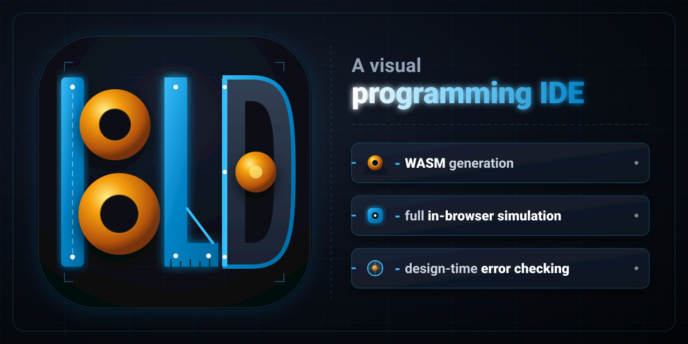
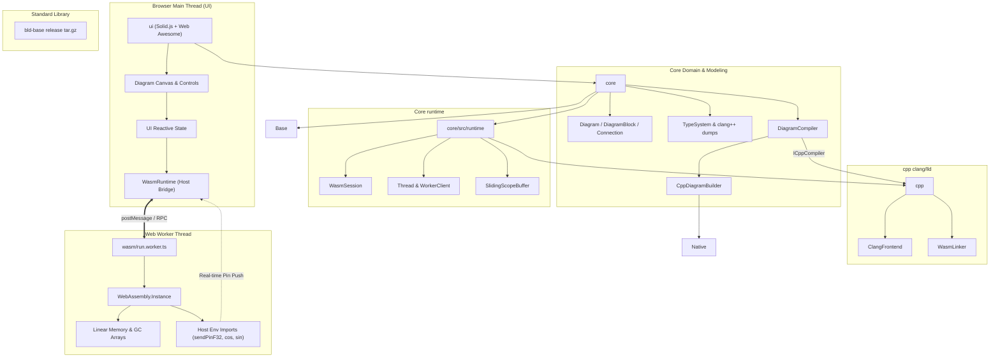
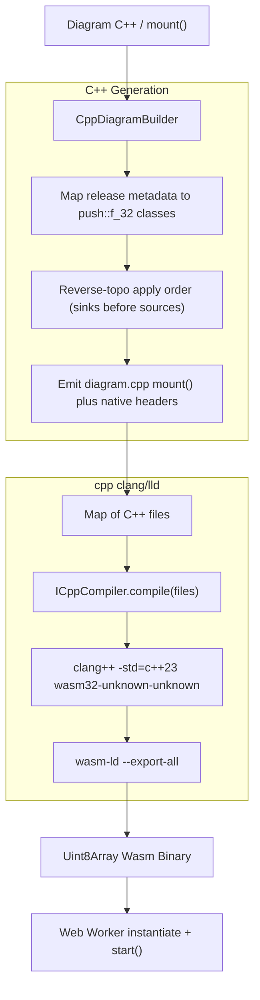
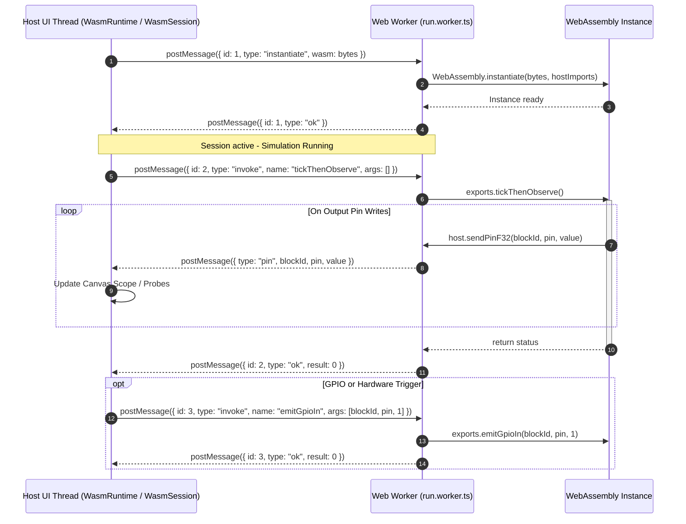
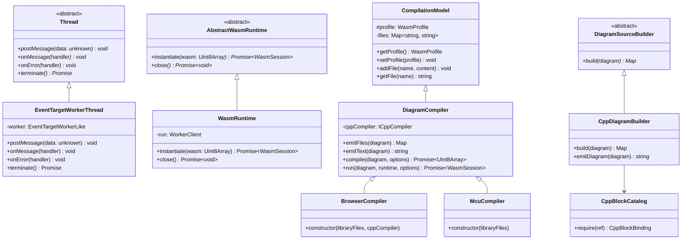

[](https://www.typescriptlang.org/)
[](https://webassembly.org/)
[](https://isocpp.org/)
[](https://www.solidjs.com/)
[](https://rsbuild.dev/)
[](LICENSE)

> A modern, client-side Visual Programming IDE and compiler for creating, editing, and executing reactive dataflow diagrams. Diagrams are translated to **C++** against the native base library and compiled in the browser to **WebAssembly** with **clang/lld**, running isolated inside Web Worker threads, with an MCU deployment target reserved for embedded devices.

---

## Table of Contents

- [Overview](#overview)
- [Key Features](#key-features)
- [Architecture & Monorepo Layout](#architecture--monorepo-layout)
- [System Architecture](#system-architecture)
- [Compilation Pipeline](#compilation-pipeline)
- [Worker Threading & Host Communication](#worker-threading--host-communication)
- [Scope Buffers & Pin Inspection](#scope-buffers--pin-inspection)
- [Object-Oriented Design & Class Hierarchies](#object-oriented-design--class-hierarchies)
- [Type System](#type-system)
- [Standard Block Library (`base`)](#standard-block-library-base)
- [Diagram File](#diagram-file)
- [Getting Started](#getting-started)
  - [Prerequisites](#prerequisites)
  - [Installation](#installation)
  - [Build](#build)
  - [Running the Development Server](#running-the-development-server)
  - [Running Tests](#running-tests)
- [Testing Strategy](#testing-strategy)
- [License](#license)

---

## Overview

**bld** provides a modular, visual programming environment designed for high-performance reactive computation. Users build diagrams from typed blocks (sources, mathematical transformers, filters, sinks, and hardware I/O pins) connected by vectorized stream channels.

The project features a **client-side only** architecture:
1. **Visual Diagram Modeling**: Interactive canvas for assembling signal processing pipelines and reactive control algorithms.
2. **C++ to WebAssembly Compilation**: The diagram is emitted as C++ against the native base library and compiled in the browser with clang/lld.
3. **Isolated Threaded Simulation**: Generated WebAssembly binaries execute in dedicated **Web Worker threads**, keeping UI rendering responsive at 60 FPS while streaming real-time pin observations back to the host.

---

## Key Features

- **Pure Client-Side Execution**: Zero backend dependencies; compilation and execution take place entirely within the browser.
- **C++ Diagram Builder**: Generates C++ that instantiates `push::f_32` blocks from the base library and delegates wasm compilation to the `cpp` workspace.
- **Web Worker Thread Isolation**: All runtime execution runs off the main thread with non-blocking RPC communication and streaming pin updates.
- **Sliding Scope Buffers**: High-rate signal capture in the browser uses a `Float32Array`/`Float64Array` ring with a single write pointer.
- **Release metadata**: `meta.json` in the base archive lists every block, namespace, port, and parameter. Loading the palette does not invoke Clang. Parameter controls come from that manifest. Clang supplies each parameter's C++ type and default during analysis.
- **Clang type checks**: Port types and connection compatibility come from `clang++` AST dumps. Configuration properties that match their defaults are omitted from the diagram comment.
- **Production-Ready UI Stack**: Built on Solid.js, Web Awesome, dark mode by default, and bundled with Rsbuild.

---

## Architecture & Monorepo Layout

The repository is structured as an npm multi-workspace monorepo:

```
bld/
├── core/        # Domain model, Diagram, TypeSystem, C++ builder, wasm session, and scope buffers
├── cpp/         # In-browser clang/lld compilation
└── ui/          # Solid.js frontend, canvas, Web Awesome components, worker runners, and Rsbuild config
```

### Package Responsibilities

| Package | Purpose | Key Responsibilities |
|---|---|---|
| **`core`** | Domain model, C++ builder, and wasm session | `Library` points at a tar.gz URL, `LibraryArchive` unpacks it with modern-tar, `MetadataCatalog` reads `meta.json`, `Diagram` is a `mount()` entry point, `CppDiagramBuilder` and `DiagramCompiler` delegate wasm compilation to `cpp`. Worker RPC (`WasmRuntime`, `WasmSession`), host env bindings, and sliding scope buffers live in `core/src/runtime`. |
| **`cpp`** | In-browser clang/lld | Compiles generated C++ sources to wasm and executes the module in a worker. |
| **`ui`** | User Interface & Worker Host | Solid.js web app, black UI theme, palette and diagram split view, Rsbuild dev server, Cloudflare Workers static assets (`wrangler.json`, not Pages), browser Worker hosting (`run.worker.ts`). |

---

## System Architecture

The following diagram illustrates the dependency topology and system boundaries across the packages and host environments:


```mermaid
graph TD
    subgraph BrowserUI["Browser Main Thread (UI)"]
        UI["ui (Solid.js + Web Awesome)"]
        Canvas["Diagram Canvas & Controls"]
        UIState["UI Reactive State"]
        WasmRT["WasmRuntime (Host Bridge)"]
        
        UI --> Canvas
        Canvas --> UIState
        UIState --> WasmRT
    end

    subgraph CoreDomain["Core Domain & Modeling"]
        Core["core"]
        Diag["Diagram / DiagramBlock / Connection"]
        TS["TypeSystem & clang++ dumps"]
        CompilerFacade["DiagramCompiler"]
        Builder["CppDiagramBuilder"]

        Core --> Diag
        Core --> TS
        Core --> CompilerFacade
        CompilerFacade --> Builder
    end

    subgraph RuntimePackage["Core runtime"]
        Runtime["core/src/runtime"]
        Session["WasmSession"]
        ThreadMod["Thread & WorkerClient"]
        Buffers["SlidingScopeBuffer"]

        Runtime --> Session
        Runtime --> ThreadMod
        Runtime --> Buffers
    end

    subgraph BaseLib["Standard Library"]
        Release["bld-base release tar.gz"]
    end

    subgraph CppPkg["cpp clang/lld"]
        Cpp["cpp"]
        Clang["ClangFrontend"]
        Lld["WasmLinker"]
        Cpp --> Clang
        Cpp --> Lld
    end

    subgraph WorkerEnv["Web Worker Thread"]
        WorkerEntry["wasm/run.worker.ts"]
        WasmInst["WebAssembly.Instance"]
        SharedMem["Linear Memory & GC Arrays"]
        EnvBridge["Host Env Imports (sendPinF32, cos, sin)"]

        WorkerEntry --> WasmInst
        WasmInst --> SharedMem
        WasmInst --> EnvBridge
    end

    UI --> Core
    Core --> Runtime
    Core --> Base
    Runtime --> Cpp
    CompilerFacade -->|"ICppCompiler"| Cpp
    Builder --> Native
    WasmRT <==>|"postMessage / RPC"| WorkerEntry
    EnvBridge -.->|"Real-time Pin Push"| WasmRT
```

---

## Compilation Pipeline

When a diagram is executed, `CppDiagramBuilder` emits C++ against the native base library and `DiagramCompiler` delegates wasm compilation to the `cpp` workspace:


```mermaid
flowchart TD
    A["Diagram C++ / mount()"] --> B["CppDiagramBuilder"]
    
    subgraph Emit["C++ Generation"]
        B --> B1["Map release metadata to push::f_32 classes"]
        B1 --> B2["Reverse-topo apply order (sinks before sources)"]
        B2 --> B3["Emit diagram.cpp mount() plus native headers"]
    end
    
    B3 --> C["Map of C++ files"]
    
    subgraph ClangLld["cpp clang/lld"]
        C --> D["ICppCompiler.compile(files)"]
        D --> E["clang++ -std=c++23 wasm32-unknown-unknown"]
        E --> F["wasm-ld --export-all"]
    end
    
    F --> G["Uint8Array Wasm Binary"]
    G --> H["Web Worker instantiate + start()"]
```

---

## Worker Threading & Host Communication

To maintain 60 FPS in the user interface, WebAssembly execution is completely offloaded to a Web Worker. Communication is managed over an asynchronous message-passing RPC bridge:


```mermaid
sequenceDiagram
    autonumber
    participant UI as Host UI Thread (WasmRuntime / WasmSession)
    participant Worker as Web Worker (run.worker.ts)
    participant Wasm as WebAssembly Instance

    UI->>Worker: postMessage({ id: 1, type: "instantiate", wasm: bytes })
    Worker->>Wasm: WebAssembly.instantiate(bytes, hostImports)
    Wasm-->>Worker: Instance ready
    Worker-->>UI: postMessage({ id: 1, type: "ok" })

    Note over UI,Worker: Session active - Simulation Running

    UI->>Worker: postMessage({ id: 2, type: "invoke", name: "tickThenObserve", args: [] })
    Worker->>Wasm: exports.tickThenObserve()
    
    activate Wasm
    loop On Output Pin Writes
        Wasm->>Worker: host.sendPinF32(blockId, pin, value)
        Worker-->>UI: postMessage({ type: "pin", blockId, pin, value })
        UI->>UI: Update Canvas Scope / Probes
    end
    Wasm-->>Worker: return status
    deactivate Wasm

    Worker-->>UI: postMessage({ id: 2, type: "ok", result: 0 })

    opt GPIO or Hardware Trigger
        UI->>Worker: postMessage({ id: 3, type: "invoke", name: "emitGpioIn", args: [blockId, pin, 1] })
        Worker->>Wasm: exports.emitGpioIn(blockId, pin, 1)
        Worker-->>UI: postMessage({ id: 3, type: "ok", result: 0 })
    end
```

---

## Scope Buffers & Pin Inspection

Browser scopes keep samples in a JavaScript sliding buffer (`SlidingScopeBuffer`): a `Float32Array` or `Float64Array` plus a single write pointer. The wasm host records the latest pin values and write counts for inspection:

- `lastPin(blockId, pin)`, `hasPin(blockId, pin)`, `pinWriteCount()`
- `emitGpioIn(blockId, pinIndex, value)` to inject GPIO edges
- `setNow` / `setRandom` for deterministic generator tests
- `tick` / `tickThenObserve` to fire registered intervals

Host pin updates are pushed through `env.host_sendPinF32` so the UI can append samples to sliding buffers without polling wasm memory.

---

## Object-Oriented Design & Class Hierarchies

Following the codebase's strict Object-Oriented Programming (OOP) standard, core capabilities are modeled through inheritance, strict encapsulation, and clean contracts:


```mermaid
classDiagram
    direction TB

    %% Thread Hierarchy
    class Thread {
        <<abstract>>
        +postMessage(data: unknown)* void
        +onMessage(handler)* void
        +onError(handler)* void
        +terminate()* Promise
    }
    class EventTargetWorkerThread {
        -worker: EventTargetWorkerLike
        +postMessage(data: unknown) void
        +onMessage(handler) void
        +onError(handler) void
        +terminate() Promise
    }
    Thread <|-- EventTargetWorkerThread

    %% Runtime Hierarchy
    class AbstractWasmRuntime {
        <<abstract>>
        +instantiate(wasm: Uint8Array)* Promise~WasmSession~
        +close()* Promise~void~
    }
    class WasmRuntime {
        -run: WorkerClient
        +instantiate(wasm: Uint8Array) Promise~WasmSession~
        +close() Promise~void~
    }
    AbstractWasmRuntime <|-- WasmRuntime

    %% Compiler Hierarchy
    class CompilationModel {
        #profile: WasmProfile
        -files: Map~string, string~
        +getProfile() WasmProfile
        +setProfile(profile) void
        +addFile(name, content) void
        +getFile(name) string
    }
    class DiagramCompiler {
        -cppCompiler: ICppCompiler
        +emitFiles(diagram) Map
        +emitText(diagram) string
        +compile(diagram, options) Promise~Uint8Array~
        +run(diagram, runtime, options) Promise~WasmSession~
    }
    class BrowserCompiler {
        +constructor(libraryFiles, cppCompiler)
    }
    class McuCompiler {
        +constructor(libraryFiles)
    }
    CompilationModel <|-- DiagramCompiler
    DiagramCompiler <|-- BrowserCompiler
    DiagramCompiler <|-- McuCompiler

    class DiagramSourceBuilder {
        <<abstract>>
        +build(diagram)* Map
    }
    class CppDiagramBuilder {
        +build(diagram) Map
        +emitDiagram(diagram) string
    }
    class CppBlockCatalog {
        +require(ref) CppBlockBinding
    }
    DiagramSourceBuilder <|-- CppDiagramBuilder
    CppDiagramBuilder --> CppBlockCatalog
```

---

## Type System

`CppDiagramBuilder.analyze()` assembles C++23 with `auto` variables for each input and output field, then asks Clang for its JSON AST. A first pass discovers constructor types and defaults; a second pass checks the connected program with the chosen configuration. The same builder produces the sources for wasm compilation.

```ts
const result = await diagram.analyze();
const ports = result.toJSON().ports;
// { blockId, direction, portId, type, canonicalType, vector, vectorLength }
const errors = result.diagnostics.filter(d => d.severity === "error");
// Connection errors include blockId, inputId, outputId, connectionId, from, to.
```

Use `canConnect()` for immediate structural checks (endpoints, direction, duplicates, and cycles). Use `await canConnectAsync()` to check a proposed connection with Clang without changing the diagram. `DiagramCompiler.compile()` performs analysis and throws `DiagramCompilationError` with structured diagnostics if it fails. Synchronous inference is available for host Clang tests; browser clients use the asynchronous API.

Parameter ids, titles, descriptions, icons, and controls come from the release `parameters` array. Clang fills each parameter's C++ type and default during analysis. Run analysis before emitting configured sources directly with `builder.build()`. `compile()` handles this automatically. Default configuration values are omitted from JSON after the definitions have been discovered.

## Standard Block Library (`base`)

The [base v0.1.0 archive](https://github.com/dzmauchy/bld-base/releases/download/v0.1.0/base-0.1.0.tar.gz) contains 22 blocks in `push::f_32` and `push::f_64`. References use the exact metadata IDs, such as `ConstF32`, `ScopeF32`, and `ScopeF64`. Header directory paths are preserved. Block types are concrete classes and aliases, constructed as `push::f_32::sinks::ScopeF32(blockId, ...)`.

| Block family | Input fields | Output fields | Parameters |
|---|---|---|---|
| Const | `downstream` | none | `value` |
| SinGen, CosGen | `downstream` | none | `precision`, `frequency`, `amplitude`, `phase` |
| RandGen | `downstream` | none | `precision`, `amplitude` |
| PulseGen | `downstream` | none | `dutyCycle`, `amplitude`, `frequency`, `phase` |
| GpioIn | `pins` | none | `port`, `pins` |
| Sin, Cos | `downstream` | `consumer` | none |
| Sum, Product | `downstream` | `channels` | `precision` |
| Scope | none | `channels` | `period`, `precision` |

Connections pass consumer handles from output fields to input fields. Scope, sum, and product expose `channels` as a vectorized function: `scope->apply().channels(count)`. For example, `ScopeF32.channels[0]` connects to `ConstF32.downstream`. Signals subsequently flow from the constant to the scope. Sinks such as Scope take no input, so `apply()` is called without arguments. Inferred types come from the C++ fields, including both numeric precisions.

## Diagram File

Diagrams support JSON import/export and a C++ `mount()` entry point with an attached JSON comment. See [`core/assets/diagram_demo.cpp`](core/assets/diagram_demo.cpp). The application supplies the browser HAL adapter; the release archive supplies the block headers and metadata.

Both AST analysis and wasm compilation use `-std=c++23`, `--target=wasm32-unknown-unknown`, and `-stdlib=libc++`. Compiler assets (`clang.js`, `clang.wasm`, `lld.js`, `lld.wasm`, `sysroot.tgz`) come from [clang-23.1.2](https://github.com/dzmauchy/clang-wasm/releases/tag/clang-23.1.2). The sysroot packages LLVM libc, libc++, libc++abi, math, compiler builtins, and the browser runtime in `/sysroot/lib`. Generated modules use `env.js_print_char`, `env.js_now`, and `env.js_time` for output and clocks without requiring WASI. Compilation and runtime execution run in browser workers. The same-origin asset relay only delivers release files.

---

## Getting Started

### Prerequisites

- **Node.js**: `v20.0.0` or later (LTS recommended)
- **npm**: `v10.0.0` or later

### Installation

Clone the repository and install all workspace dependencies:

```bash
git clone https://github.com/dzmauchy/bld.git
cd bld
npm install
```

### Build

Compile all workspaces and generate TypeScript declaration files:

```bash
# Build core, cpp, and ui
npm run build --workspaces
```

Or build specific workspaces:

```bash
npm run build --workspace=core     # Typechecks model, C++ builder, wasm session, and sliding buffers
npm run build --workspace=cpp      # Typechecks in-browser clang/lld
npm run build --workspace=ui       # Bundles Solid.js UI via Rsbuild
```

### Running the Development Server

Launch the Rsbuild development server with hot module reloading:

```bash
npm run dev --workspace=ui
```

Open [http://localhost:3000](http://localhost:3000) in your browser to view the application.

### Running Tests

The workspace follows a tiered testing approach:

```bash
# Run all test suites across all packages (including e2e)
npm test

# Run only unit test suites across all packages
npm run test:unit

# Run unit tests for a specific workspace
npm run test:unit --workspace=core
```

---

## Testing Strategy

The repository follows a clean, three-layer test layout:

```
├── tests/
│   ├── unit/          # Fast unit tests for isolated classes and data structures
│   └── integration/   # Multi-module integration tests (Wasm compilation, runtime workers)
└── e2e/               # End-to-end diagram compilation, session execution, and Playwright UI tests
```

- **Unit Tests**: Verify isolated models (`Diagram`, `CppDiagramBuilder`, `CppBlockCatalog`, `TypeSystem`, `SlidingScopeBuffer`).
- **Integration Tests**: Verify generated `mount()` matches header block refs and native `push::f_32` class names.
- **E2E Tests**: Clang integration tests in `core/tests/integration`, and in-browser clang/lld compile+run tests in `cpp/e2e/diagram.spec.ts` covering scopes and GPIO.

---

## License

This project is licensed under the **GNU Affero General Public License v3.0** (`AGPL-3.0-only`). See the [LICENSE](LICENSE) file for complete details.
